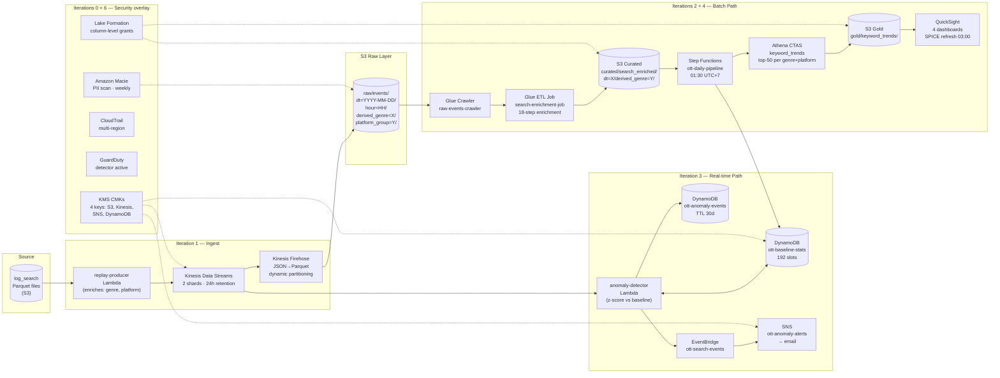

# Architecture Overview

## Full pipeline

## Dual-path design rationale

The same Kinesis stream feeds two consumers simultaneously:

**Real-time path (Lambda ESM)** answers *"is something wrong right now?"* The anomaly-detector Lambda receives records within seconds of ingestion, computes a z-score against the DynamoDB baseline, and publishes an EventBridge event → SNS alert in under 5 minutes. This path is always on.

**Batch path (Firehose + Glue)** answers *"what is trending?"* with full historical context. Firehose buffers records into 64 MB Parquet files and writes them to S3 every 60 seconds. Glue runs overnight with 2 DPUs, applying the full 18-step enrichment pipeline including repeat-search detection (which requires a window over the session — not feasible in streaming). The result is available in QuickSight SPICE by 02:00.

Separating these paths means an anomaly alert is never delayed by a slow Glue job. Each service is in the role it is designed for: Kinesis for latency, Glue for throughput.

---

## Data-flow schema

### Raw layer — 12 columns

Stored at `s3://ott-search-{account}-{env}/raw/events/dt=.../hour=.../derived_genre=.../platform_group=.../`

| Column | Type | Source |
|---|---|---|
| `eventid` | string | Original |
| `datetime` | string | Original (may contain Arabic numerals or Buddhist year) |
| `user_id` | string | Original (null for 25.3% of events — unauthenticated) |
| `keyword` | string | Original |
| `category` | string | Original (`enter` or `quit`) |
| `proxy_isp` | string | Original |
| `platform` | string | Original (35 distinct device strings) |
| `networktype` | string | Original (9 dirty values) |
| `action` | string | Original |
| `userplansmap` | array\<string\> | Original (subscription plan list) |
| `derived_genre` | string | **Added by replay-producer** (8 values + UNKNOWN) |
| `platform_group` | string | **Added by replay-producer** (OTTBox/SmartTV/Android/iOS/Web/Other) |

### Curated layer — 18 columns

Stored at `s3://ott-search-{account}-{env}/curated/search_enriched/dt=.../derived_genre=.../`

| Column | Added by step | Description |
|---|---|---|
| `event_id` | 1 | Renamed eventid |
| `event_ts` | 2 | Parsed timestamp (UTC) |
| `hour_of_day_vn` | 4 | Vietnam-timezone hour (0–23) |
| `user_id_hashed` | 8 | SHA-256 of user_id (null-safe) |
| `user_is_authenticated` | 7 | user_id IS NOT NULL |
| `session_action` | 5 | `enter` or `quit` (passthrough of category) |
| `is_search_abandoned` | 6 | category == 'quit' |
| `keyword_norm` | 9 | lower(trim(keyword)) |
| `keyword_is_null` | rename | keyword was null |
| `derived_genre` | 10 | Rule-based classifier (+ optional LLM fallback) |
| `platform_group` | 11 | 35 strings → 5 buckets |
| `network_type_norm` | 12 | 9 values → 5 canonical |
| `isp_segment` | 13 | upper(proxy_isp) |
| `has_premium` | 14 | Any of VIP/HBO GO+/K+/MAX in userplansmap |
| `subscription_count` | 15 | len(userplansmap), null for unauthenticated |
| `search_session_id` | 16 | SHA-256(user_id\|30min_bucket) or SHA-256(isp\|platform\|30min_bucket) |
| `is_repeat_search` | 17 | same keyword as previous in session (LAG window) |
| `is_cross_partition_date` | 18 | event year ≠ dt partition year (corrupted rows) |

### Gold layer — 16 columns

Stored at `s3://ott-search-{account}-{env}/gold/keyword_trends/trend_date=.../derived_genre=.../`

| Column | Description |
|---|---|
| `keyword_norm` | The search term |
| `platform_group` | Device class |
| `network_type_norm` | Connection type |
| `isp_segment` | ISP name |
| `search_count` | Total searches (enter + quit) |
| `enter_count` | Searches with result selection |
| `abandonment_rate` | 1 − enter_count/search_count |
| `unique_users` | COUNT(DISTINCT user_id_hashed) |
| `authenticated_rate` | Fraction with known user_id |
| `repeat_search_rate` | Fraction that are repeat searches |
| `premium_search_rate` | Fraction by premium subscribers |
| `rank_today` | Rank within (derived_genre, platform_group) by enter_count |
| `rank_7d_ago` | Same rank from 7 days prior (COALESCE 9999 if new) |
| `rank_delta` | rank_7d_ago − rank_today (positive = rising) |
| `trend_date` | Partition key: date of analysis |
| `derived_genre` | Partition key: content genre |
